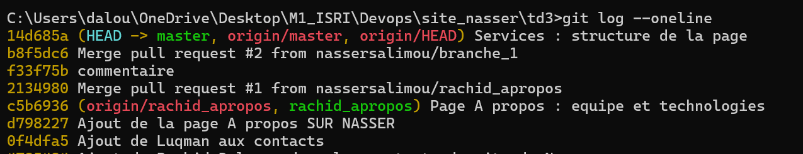

## Page Services : historique avant le squash

Les commits de développement de la page Services, avant le rebase interactif :

## Page Services : historique après le squash

Un seul commit après `git rebase -i master` :

